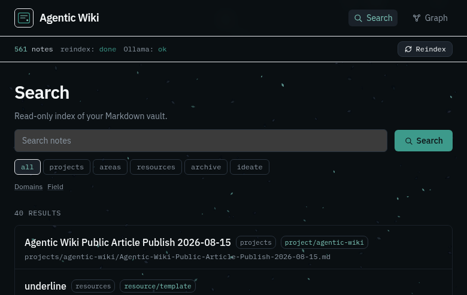

# Build a Local Agentic Wiki Over Your Notes

> A practical idea piece: turn a personal knowledge vault into a searchable, chat-capable wiki — without giving away a private lab recipe.


*Figure 1 — Note reader with vault metadata and a “Chat with this note” entry point.*

---

## Why bother?

Most people already have notes: Obsidian, Markdown folders, course writeups, lab journals. Search inside the editor is fine until you want:

1. **A browser UI** you can open on the LAN or through a tunnel
2. **Semantic search** (“where did I write about DNS tunnels?”)
3. **Grounded chat** that answers from *your* notes, with citations

That combination is what I call an **agentic wiki**: the vault stays the source of truth; a derived index powers search + RAG. You still write in your editor. The wiki is a read-only lens.

This article is intentionally **idea-level**. Exact hostnames, ports, passwords, folder layouts, and proprietary automation are omitted on purpose. Steal the architecture, invent your own wiring.

---

## The shape of the system

```text
  [ Markdown vault ] --read-only--> [ Ingest + embed ]
                                         |
                                         v
                                   [ Vector DB ]
                                         |
                    +--------------------+--------------------+
                    |                    |                    |
                 Search UI           Graph view          Note chat
                 (filters)         (wikilinks)         (RAG modes)
```

**Four pieces, nothing exotic:**

| Piece | Job |
|---|---|
| Vault | Your Markdown notes (keep writing here) |
| Indexer | Watches files, parses frontmatter/wikilinks, embeds text |
| Store | Postgres + vector extension (or any pgvector-compatible store) |
| UI | Search, reader, graph, chat panel |

Local models (via Ollama or similar) handle **embeddings** and optional **chat**. Cloud models are optional; the idea works fully offline.

---

## Design principles that keep you sane

1. **Vault is sacred** — mount it read-only into the indexer/UI stack. Never let the chat agent write back unless you explicitly build a “save draft” flow later.
2. **Derived index, not a second brain** — if the DB dies, regenerate from Markdown. Obsidian (or your editor) remains canonical.
3. **PARA + domains** — filter by life buckets (projects / areas / resources / archive) *and* by topic folders (red team, network, cloud, …). Path-based mapping beats fragile tags alone.
4. **Same-origin API** — if you expose the UI through Cloudflare Tunnel or LAN, the browser should call `/api/...` on the same host. Hardcoding `127.0.0.1` breaks remote clients.
5. **Screenshots belong in the vault** — Obsidian embeds (`![[Pasted image….png]]`) should resolve through a small media endpoint so the reader shows lab screenshots, not broken icons.


*Figure 2 — Note-scoped chat (Vault RAG / Note+links / Note only) with a local model picker. I’ll also record a short video of vault browsing + chat on my side.*

---

## Chat that stays honest

A useful default chat mode is **Vault RAG**:

- Always include the open note
- Pull a few semantic neighbors
- Stream the answer with citation chips

Also offer **Note only** and **Note + outbound links** for days when you want maximum trust or tighter context.

Pick a solid local instruct model for chat and a dedicated embed model for vectors. Let users switch chat models in the UI; filter out OCR/vision/embed-only names from the picker.

---

## UI tone (skip the AI clutter)

If you ship a dashboard:

- One clear brand mark, not stacked logos
- Collapse advanced filters (domains, field tags) behind toggles
- Status strip: note count, index job, model health — not a telemetry wall
- Prefer calm motion (subtle particle atmosphere, fade-ins) over purple glow kits
- Add basic framebusting headers if the UI will sit on a tunnel

Atmosphere can be interactive (mouse “friction” particles) as long as it stays `pointer-events: none` and respects `prefers-reduced-motion`.



*Figure 3 — Search home: compact PARA filters, domains on demand, atmospheric background.*

---

## Getting started on your own stack

You do not need my exact compose file. Build toward this checklist:

1. **Pick a vault root** of Markdown files
2. **Run Postgres with pgvector** (localhost bind for the DB)
3. **Write a small Go/Python/Node indexer** that:
   - walks `*.md`
   - skips trash/dotdirs
   - upserts title, path, tags, body summary, embedding
   - stores wikilink edges
4. **Expose a thin REST API**: health, stats, notes, reindex, media, chat stream
5. **Ship a Next.js (or similar) reader** with search + note page + chat panel
6. **Bind UI/API for your use case** (`127.0.0.1` for solo, `0.0.0.0` + tunnel Access for remote)
7. **Full reindex once**, then rely on filesystem watch for deltas

Optional niceties: Control Hub TUI for start/stop/reindex; graph page; domain filters; async reindex with a progress strip.

---

## What I deliberately left out

- Exact repository paths, agent profiles, and private vault taxonomy
- Credentials, tunnel hostnames, LAN IPs, model download scripts
- Step-by-step “clone this compose and paste these secrets”
- Internal automation that is specific to my homelab

The goal is **transferable architecture**, not a fingerprint of my lab.

---

## Closing

An agentic wiki is not “ChatGPT over folders.” It is a **discipline**: notes remain human-owned Markdown; the machine gets a disposable index and a careful chat surface. Start small — one vault, one embed model, one search page — then add chat and screenshots when the index feels trustworthy.

If you build your own, keep the vault read-only until you are sure you want write-back. That single rule saves more pain than any fancy RAG trick.

---

*Article visuals captured from a local demo UI. Video of live vault + chat walkthrough recorded separately by the author.*
