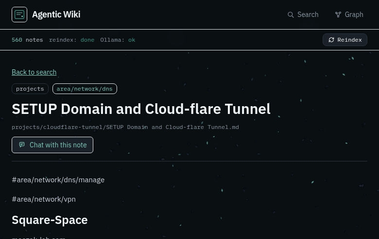
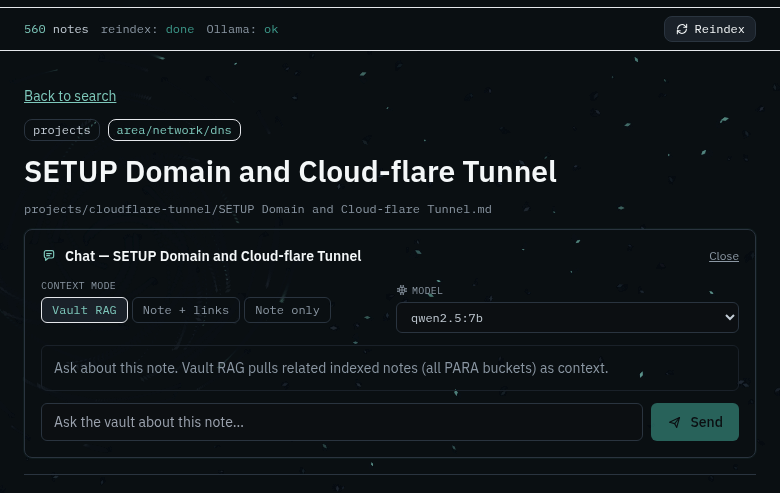

# Build a Local Agentic Wiki Over Your Notes

> I built my own agents-and-notes wiki. Not another chat window — a local system where my Markdown vault stays the source of truth, and RAG + embeddings give a local LLM real topic context without burning cloud tokens on work I already wrote down.



*Figure 1 — Note reader with vault metadata and a “Chat with this note” entry point.*

---

## The habit almost everyone has

Ask a cloud model a simple question. Paste a paragraph. Re-explain the same project for the third time this week. Pay for tokens to recover context you already stored in notes.

That pattern is fine for one-off help. It gets expensive — and noisy — when you are an AI engineer or you run agents all day. People forget how capable a **local LLM** already is for average tasks: rewrite this section, summarize this note, answer from what I already documented, draft a checklist.

The missing piece is not “a bigger frontier model.” It is **your context**, sitting next to a small model that can use it.

That is why vector databases and RAG feel so powerful locally: the model does not need to memorize your career. It retrieves the slice of your vault that matches the question, then answers with citations. Privacy stays on your machine when you want it. Agents can still call the same retrieval layer when they need grounded knowledge about a topic you already wrote.

---

## What I mean by an agentic wiki

Most people already have notes: Obsidian, Markdown folders, course writeups, lab journals. Editor search is fine until you want:

1. **A browser UI** you can open on the LAN or through a tunnel
2. **Semantic search** (“where did I write about DNS tunnels?”)
3. **Grounded chat** that answers from *your* notes, with citations

An **agentic wiki** is that combination. The vault stays human-owned Markdown. A derived index powers search and RAG. You keep writing in your editor. The wiki is a read-only lens — useful for you, and reusable by agents that should not invent facts you already captured.

This article is **idea-level**. Exact hostnames, ports, passwords, folder layouts, and proprietary automation are omitted on purpose. Steal the architecture, invent your own wiring.

---

## Why local LLMs + RAG beat “just ask the cloud”

| Pattern | What happens | Cost / risk |
|---|---|---|
| Cloud for every small task | Re-paste context every session | Tokens, leakage, shallow memory |
| Local LLM with no retrieval | Model guesses from general training | Confident, wrong, or empty |
| Local LLM + embeddings + vector store | Retrieve your notes, then generate | Free inference on your box, grounded answers |
| Agentic tools + same RAG layer | Agents query your topic memory | Less hallucination on *your* domain |

**Embeddings** turn note chunks into vectors. A **vector database** finds neighbors for a question. **RAG** stuffs those neighbors into the prompt so a local instruct model can answer with your wording and your structure — not a random web average.

That stack helps AI engineers in three practical ways:

1. **Token discipline** — use local models for routine work over your notes; reserve cloud budget for hard reasoning.
2. **Privacy** — keep sensitive writeups, lab journals, and client-safe notes offline while still chatting against them.
3. **Continuity** — agents and humans share one retrieval surface: “continue from what I already documented about this topic.”

RAG does not make a 7B model into a frontier lab. It makes a small model **knowledgeable about your corpus** — which is often what you actually needed.

---

## The shape of the system

```text
  [ Markdown vault ] --read-only--> [ Ingest + embed ]
                                         |
                                         v
                                   [ Vector DB ]
                                         |
                    +--------------------+--------------------+
                    |                    |                    |
                 Search UI           Graph view          Note chat
                 (filters)         (wikilinks)         (RAG modes)
```

**Four pieces, nothing exotic:**

| Piece | Job |
|---|---|
| Vault | Your Markdown notes (keep writing here) |
| Indexer | Watches files, parses frontmatter/wikilinks, embeds text |
| Store | Postgres + vector extension (or any pgvector-compatible store) |
| UI | Search, reader, graph, chat panel |

Local models (via Ollama or similar) handle **embeddings** and optional **chat**. Cloud models are optional; the idea works fully offline. Agents can call the same search/chat APIs instead of inventing a second memory system.

---

## Design principles that keep you sane

1. **Vault is sacred** — mount it read-only into the indexer/UI stack. Never let the chat agent write back unless you explicitly build a “save draft” flow later.
2. **Derived index, not a second brain** — if the DB dies, regenerate from Markdown. Obsidian (or your editor) remains canonical.
3. **PARA + domains** — filter by life buckets (projects / areas / resources / archive) *and* by topic folders (red team, network, cloud, …). Path-based mapping beats fragile tags alone.
4. **Same-origin API** — if you expose the UI through a tunnel or LAN, the browser should call `/api/...` on the same host. Hardcoding `127.0.0.1` breaks remote clients.
5. **Screenshots belong in the vault** — Obsidian embeds (`![[Pasted image….png]]`) should resolve through a small media endpoint so the reader shows lab screenshots, not broken icons.



*Figure 2 — Note-scoped chat (Vault RAG / Note+links / Note only) with a local model picker.*

---

## Chat that stays honest

A useful default chat mode is **Vault RAG**:

- Always include the open note
- Pull a few semantic neighbors from the vector store
- Stream the answer with citation chips

Also offer **Note only** and **Note + outbound links** for days when you want maximum trust or tighter context.

Use a dedicated **embed model** for vectors and a separate **instruct model** for chat. Let users switch chat models in the UI; keep embed-only and vision/OCR names out of the chat picker. The same retrieval modes are what you expose to agents: narrow context when the task is local, wider vault RAG when the topic spans many notes.

---

## Getting started on your own stack

You do not need my exact compose file. Build toward this checklist:

1. **Pick a vault root** of Markdown files
2. **Run Postgres with pgvector** (localhost bind for the DB)
3. **Write a small Go/Python/Node indexer** that:
   - walks `*.md`
   - skips trash/dotdirs
   - upserts title, path, tags, body summary, embedding
   - stores wikilink edges
4. **Expose a thin REST API**: health, stats, notes, reindex, media, chat stream
5. **Ship a reader UI** with search + note page + chat panel
6. **Bind UI/API for your use case** (solo localhost, or broader bind + access control for remote)
7. **Full reindex once**, then rely on filesystem watch for deltas

Optional niceties: a small control TUI for start/stop/reindex; a graph page; domain filters; async reindex with a progress strip; agent-facing search that returns citations the same way the UI does.

---

## What I deliberately left out

- Exact repository paths, agent profiles, and private vault taxonomy
- Credentials, tunnel hostnames, LAN IPs, model download scripts
- Step-by-step “clone this compose and paste these secrets”
- Internal automation that is specific to my homelab
- Pixel-level UI styling and dashboard cosmetics

The goal is **transferable architecture**, not a fingerprint of my lab.

---

## Closing

I did not build “ChatGPT over folders.” I built a **discipline**: notes remain human-owned Markdown; the machine gets a disposable vector index and a careful chat surface that local models — and agents — can use without re-buying the same context every time.

Start small: one vault, one embed model, one search page. Add chat when retrieval feels trustworthy. Keep the vault read-only until you are sure you want write-back. That single rule saves more pain than any fancy RAG trick.

If you work with AI tools daily, try the experiment: send the next *simple* task to a local model that already has your notes in a vector store. The average person will still open a cloud chat. You will already be answering from *your* wiki.

---

*Article visuals captured from a local demo UI.*
